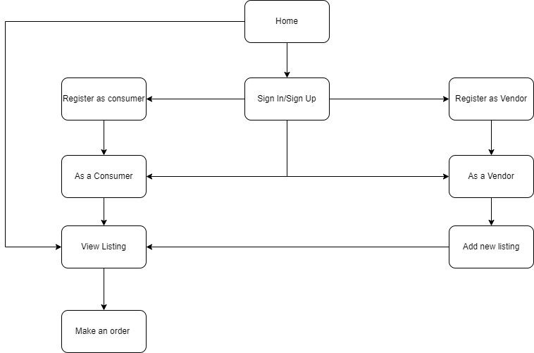
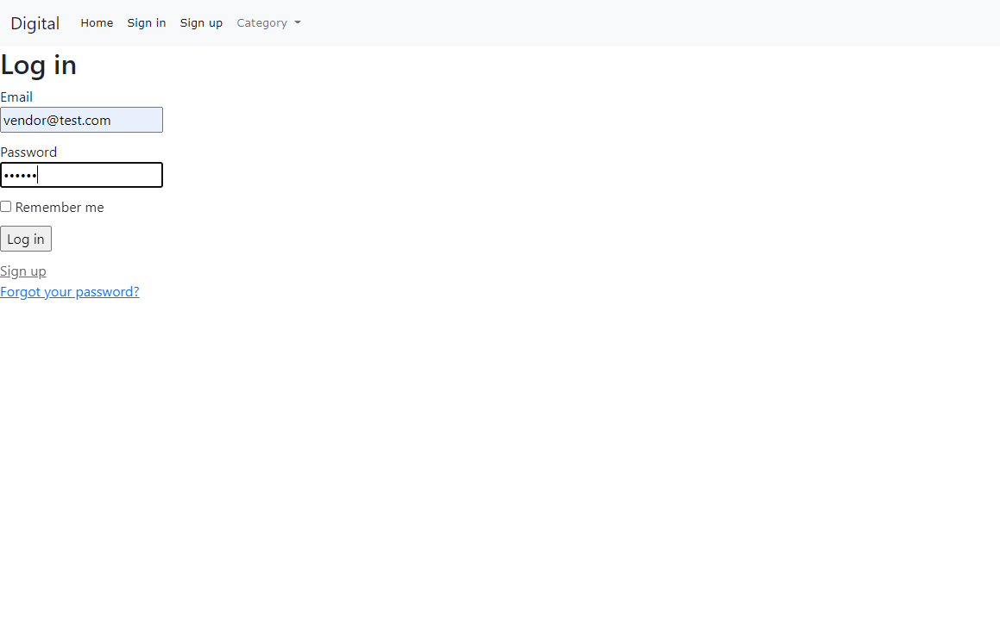
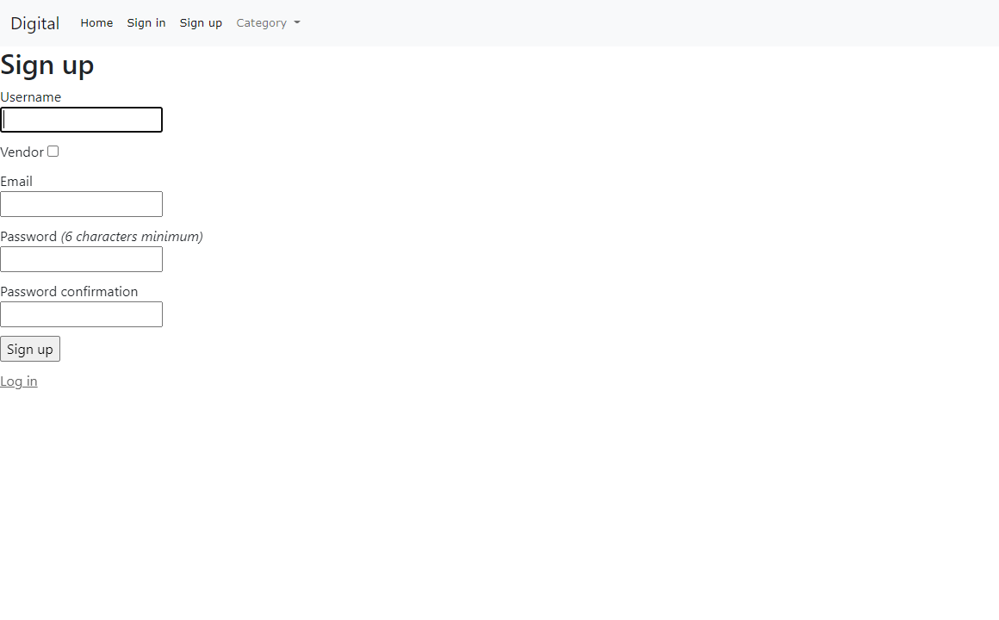
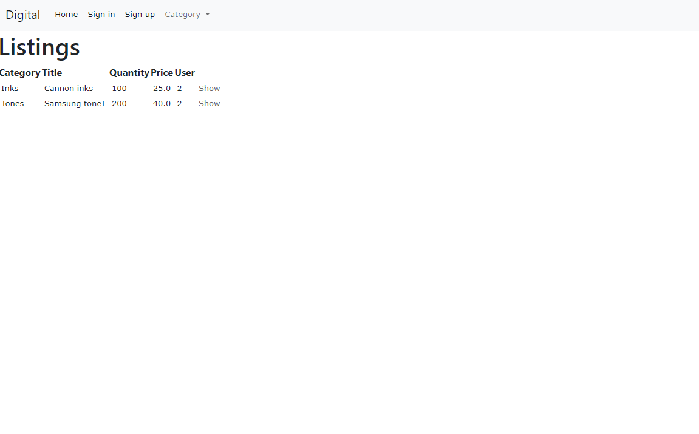
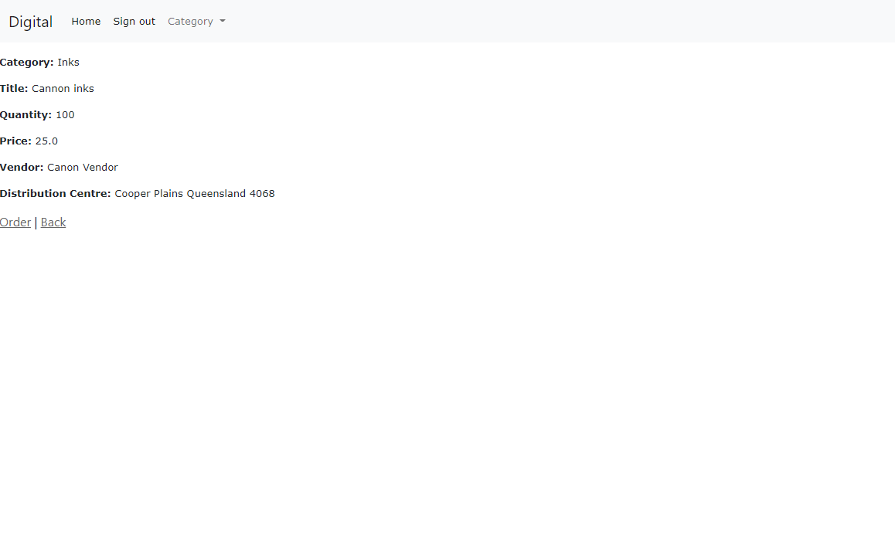
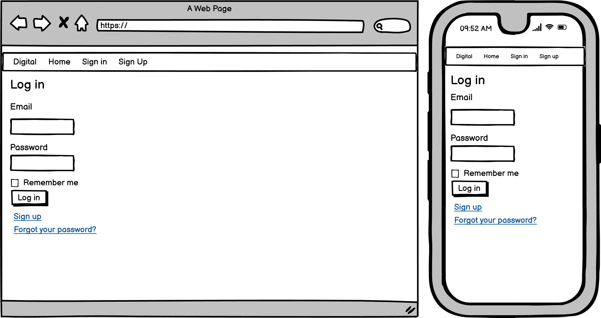
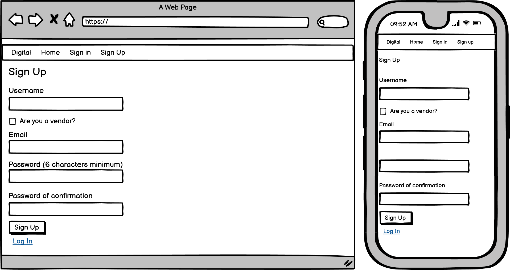
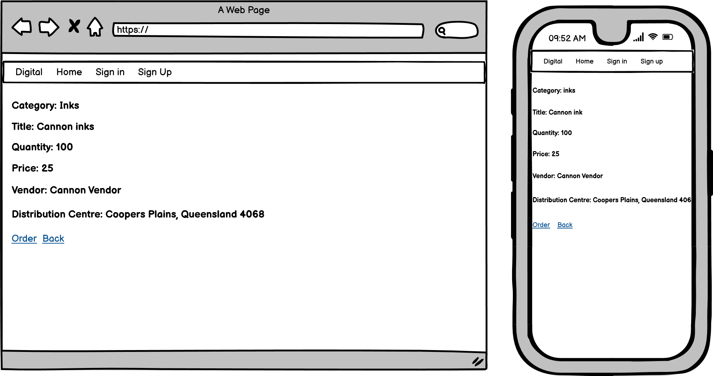
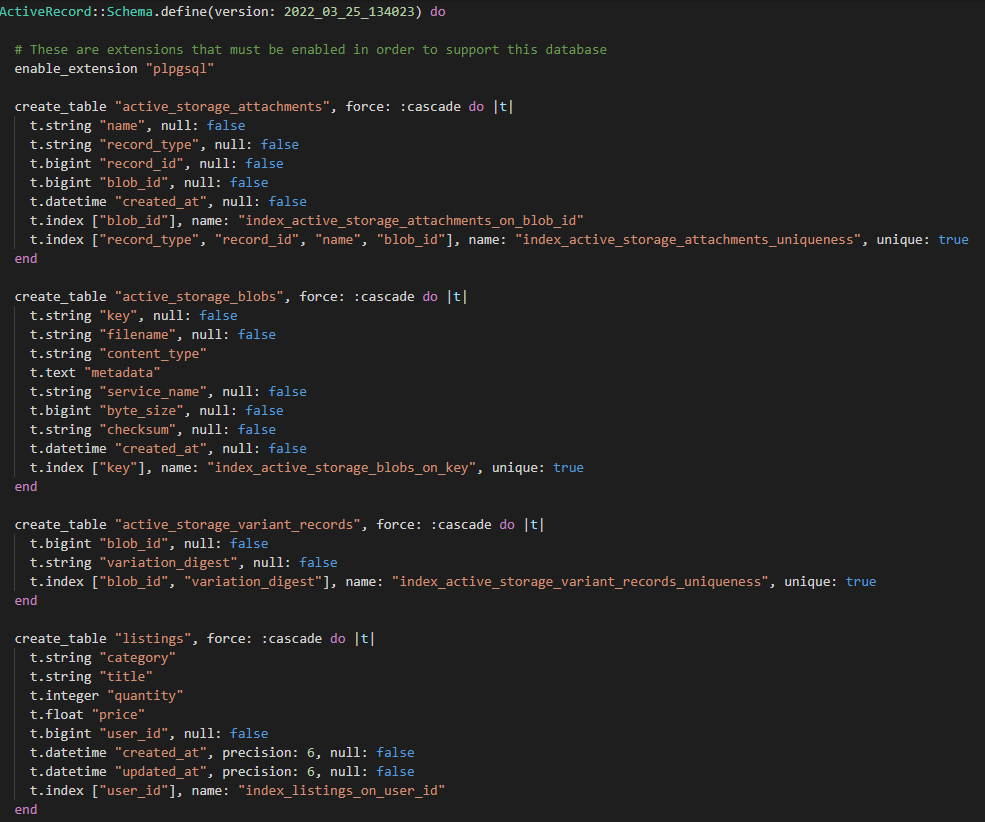
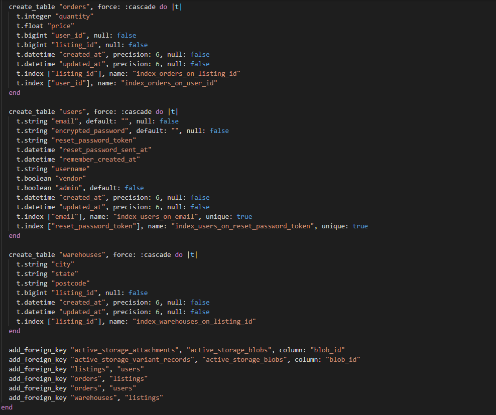

# Readme

**R7 Identification of the problem you are trying to solve by building this particular marketplace app.**

Due to the arise of COVID pandemic during the year 2020, this had changes the new norm of many of people started to work from home instead of going back to their respective office or having a hybrid model work from home and office. Because of this, office and printing products have seen a significant increase in demand from officer workers. Hence, this website is designed to bring onboard various vendors/suppliers from printing industry and connect them online with any people who needs printing products. This platform would allow buyers to have more option and access to various different vendor/supplier of their choice. Also, more vendor/supplier means more supply of products to the market that in need without caused any shortage of inventory when products are in huge demand. This platform will brings more supply of products to the market from more vendors. 

 

**R8 Why is it a problem that needs solving?**

It has been shown that the printing industry has been dominated by only a few major suppliers for the past few years in Australia. Because of this, we seen that the market have experienced shortage of products and operational difficulty during the pandemic period when demand is increased significantly. This has burdened the system and decreased the operational flow in the industry. This could also led to challenging situations for company workers when they are running out of printing product. As a result, this platform aim to address those challenges and help the printing industry to be more competitive and ease the supply and demand of the market.

 

**R9 A link (URL) to your deployed app (i.e. website)**

[**My website**](https://t2a2-marketplace-project.herokuapp.com/)

 

**R10 A link to your GitHub repository (repo).**

[**Github repository**](https://github.com/jonathan5057/T2A2-Marketplace-Project)

 

**R11 Description of your marketplace app (website), including:**

**Purpose**

The purpose of this marketplace application aims to help consumers sourcing for printing supplies from multiple vendors which to increased the competitiveness in the market. As the world is slowly moving towards working from home, consumers are increasingly spending more time working from home which led to increase in demand for printing supplies. Our app emerged as the perfect solution for both consumers and vendors to help them to increased the competitiveness and effectiveness in the market and achieved a win-win situation. 

 

**- Functionality / features**

Below is the list of key features being implemented:

**Buyer**

1. Login and registration 
2. View products and price
3. Place an order and quantity of the product 

**Vendor**

1. Login and registration 
2. checkbox to be vendor.
3. Add a new product to sell.
4. Update information on products to sell.

 

**Sitemap**

 

**Screenshots**

 

**Target audience:**

The target audience are vendor/supplier of digital printing products around Australia and buyer who are either officer worker or people who work from home that need printing products.

 

**Tech stack (e.g. html, css, deployment platform, etc)**

Here is the list of technologies stack being used to build the complete application.

1. Hosting - Heroku
2. Frontend - CSS, SCSS, and HTML
3. Backend - Ruby on Rail framework and Ruby programming language.
4. Database -  postgresql 
5. Data Storage - AWS S3 bucket 
6. API - devise authentication, bootstrap

 

**R12 User stories for your app**

1. As a user (consumer), I want to log in with secure authentication into my account, so that I could know any further information about the products and make any purchase.

2. As a user (consumer), I want to view the general listings of the product from various vendors, So that I could search for the product that I would like to purchase.

3. As a user (consumer), I want to place an order for the particular products from vendors, So that I could make a purchase of the products that I am looking for. 

4. As a user (vendor), I want to be able to register an account as a vendor, so that I could start offering products for sales on the platform. 

5. As a user (vendor), I want to be able to add new listing of product and updated information that I wish to sell, so that I could have my products visible to buyers and they could buy it from the platform. 

6. As a user (vendor), I want to be able to view the remaining quantity of my products, so that I could update or stock up my inventory for my products.

 

**R13 Wireframes for your app**

The wireframes can be found inside docs folder.

Example:

 

 

 

**R14 An ERD for your app**

 

**R15 Explain the different high-level components (abstractions) in your app**

**MVC architecture of marketplace app:**

The marketplace app is developed with the used of rails framework with design of MVC architecture that essentially divided into 3 components of Model, View and Controller 

 

**Model**

The models are classes in Rails. They interact with database, store data, handles validation and transaction.
This subsystem is implemented with the help of ActiveRecord library. This library provides an interface between database tables and Ruby program code that manipulates database records. Through Object-relational mapping, these models or classes connect to their respective database tables. Hence, this allow the application to retrieve data from postgresql database management system to use it as the logic for the platform. The models for this application are User, Listing, Order and Warehouse. 

 

**View**

The View represent data in a particular format in an application for the users. It handles HTML, SCSS, JavaScript and XML in an application. They do what controller tells them.
This subsystem is implemented in ActionView library. This library is an Embedded Ruby (Erb) based system which define presentation templates for data presentation. There are separate views for devise, listing and orders. Each view has an index, new, edit and show.html.erb files in it. The view compiles the response by the controller and displays it to the user.

 

**Controller**

The controller directs traffic to views and models. It query models for data from the database and display the desired result with the help of view in an application.
This subsystem is implemented in ActionController library. This library is a data broker sitting between ActiveRecord and ActionView. The controllers for this application are the following:

1. Listing Controller: To obtain data from Listing model and displays the listing information via views. It also helps to update and edit listing information. 
2. Order Controller: To obtain data from Listing model and displays the listing information via views. Is also helps with the calculation of quantity order and stock availability for each listings. 

 

**Database:**

PostgresSQL database system (RDMS) is chosen for this application which provide easy mapping of each model object to their respective database tables.

 

**R16 Detail any third party services that your app will use**

**1. Devise**

Currently the most popular third party provider to serve the authentication part of the application. This is because the service offers industry standard security, and make it remarkably easy to override parts of the authentication system without affecting the rest.

**Helpful Features:**

- To provide the option of sign up and sign in for user authentication.
- To store user passwords by using hashes in encrypted form to protect any leak of sensitive information.
- Lots of great support features (forgot passwords, user activation, invalid password lockouts, remember-me token and more). 
- It is an extremely flexible and mature authentication software.

 

**2. Amazon Web Service S3 Cloud Storage**

Amazon Simple Storage Service (Amazon S3) is an object storage service that offers industry-leading scalability, data availability, security, and performance. This means customers of all sizes and industries can use it to store and protect any amount of data for a range of use cases, such as websites, mobile applications, backup and restore, archive, enterprise applications, IoT devices, and big data analytics.

**Helpful features:**

- To store user data including user pictures
- Free plan for prototyping an app which mean no cost occurred in developing this application. 
- The speed to upload any files and image is fast and efficient. 
- The bucket files are easily accessible to any creator or owner of the apps. However it restricted any access to external parties unless the master key was provided. 

 

**R17 Describe your projects models in terms of the relationships (active record associations) they have with each other**

**User Model**
The user model is being created to serve both consumers and vendors and it would be determined through a checkbox (boolean data type) when they signed up for an account. This model helps to define the data for the user based on their username, email and their identity such as consumer or vendor.  

Relationship/Association:
1. has many: listings
2. has many: orders

 

**Listing Model**
The listing model is the most essential model in the database where it serve as the main brain for the entire model. Listing can be added by vendor.

Relationship/Association:
1. belongs to: user
2. has one: warehouse
3. has many: orders

 

**Order Model**
This order model server as the connection between consumer to vendor and act as the transaction records when a consumer is ordering a product from vendor. 

Relationship/Association:
1. belongs to: user
2. belongs to: listing

 

**Warehouse Model**
This model contains the addresses of warehouse that asscociated to the listing model where each new product listing is added by each vendors.

Relationship/Association:
1. belongs_to: listing

 

**R18 Discuss the database relations to be implemented in your application**

**Database Tables in the database**

1. users
2. listings
3. orders
4. warehouse

 

Foreign keys has been used to connect model to model in creating the business logic of ther application.  

The database relations begin from User model where it stores both consumer and vendor information with the boolean data type to determined if the user is consumer or vendor. User Model has one to many relationship to Listing model where consumer can order zero to many different products, or vendor can add many products for sale. 

The Listing model has many to many relationship with the Warehouse Model where each product listings from any vendor can be store in many different warehouse location for easy access to Australia consumer from every city and state. 

The Order Model has many to one relationship with the User Model. Likewise, it also has many to one relationship with the Listing Model. This means each product listing can have many orders from consumers. Moreover, everytime a consumer purchases product from a vendor, quantity availability of the particular product with be updated, this means that stock of the product is reduced once consumer make an order. 

 

**R19 Provide your database schema design**

 

 

**R20 Describe the way tasks are allocated and tracked in your project**

Trello app is used to track the progress and activities throughout the cycle of this project.

The initial phrase of the project begin from planning stage to come out with required small piece of tasks. Then once the tasks are confirmed, it will then allocated into the "To Do List" followed by "Doing list" and then finally "Complete list", there is also a list of hard/stuck list. Each day I will start work on the project by picking tasks from the "TO DO LIST" and drag them into "Doing list" for that day. Once the task has been completed, I will then move them to "complete list" to tick off my task. I will then keep going back to the "TO DO List" to pick the tasks again until I completed the whole project. 

[Link to my Trello Board](https://trello.com/b/AgYEYoKw/jonathantant2a2)